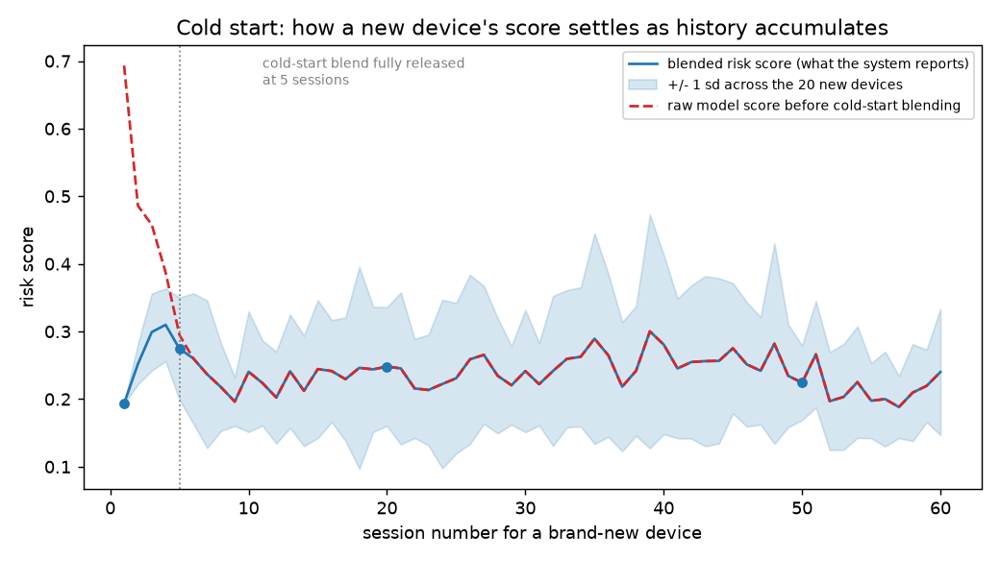
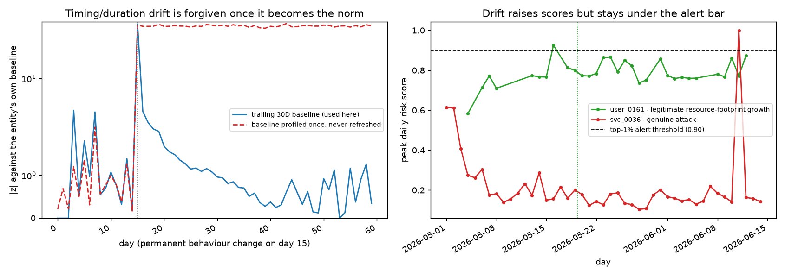

# Behavioral Anomaly Detection - Report

## Problem

Model "normal" access behavior per entity (user, service account, edge
device), detect intrusions or compromised-credential activity from access
logs, classify the anomaly type, and produce a risk score an analyst can
actually act on - all under extreme class imbalance and with no real intrusion
data to train on.

## Synthetic data

Real access logs for this kind of problem are scarce and privacy-restricted,
so `src/generator/` builds a synthetic one instead: 250 users, 40 service
accounts, and 80 edge devices, each with its own habitual login hours, home
location, typical resource set, and (for privileged sessions) command
sequence, sampled with noise over a 45-day window. A handful of entities join
partway through the window to exercise the cold-start path.

Seven attack patterns are injected on top of the normal traffic - six of them
true positives, the seventh (insider drift) an ambiguous edge case:

| Pattern | How it's simulated |
|---|---|
| Brute force | 12-60 rapid failed logins from one attacker IP against one entity |
| Impossible travel | A session placed a few minutes to a few hours after a real one, from a location that implies an unreasonable travel speed |
| Credential stuffing | Many entities (20-70), 1-3 attacker IPs, high failure rate, all within a short window |
| Lateral movement | A burst of sessions touching resources the entity has never accessed, often with privileged commands |
| Device spoofing | Same entity_id, mismatched OS/MAC fingerprint |
| Low-and-slow exfiltration | 1-3 sessions on scattered days over a 10-25 day span (most days skipped entirely), concentrated in the entity's off-hours window, gradually working through resources it has never touched before |
| Insider drift | A legitimate entity gradually expanding its resource footprint over 1-3 weeks - not treated as a hard positive, used to check the false-positive rate on slow, ambiguous behavior change |

Low-and-slow exfiltration is deliberately built to look similar to insider
drift at a glance - both are gradual, both build up over days to weeks - but
it concentrates in off-hours (insider drift samples from the entity's own
normal hour distribution, so it keeps looking routine) and is a genuine
positive rather than an edge case, so it's worth checking whether the model
can actually tell the two apart. See the per-class results below.

Injection rates land in the 0.3-0.7% range per attack type (about 3.3%
combined), matching the brief's suggested 0.5-3% band. Ground truth (`label`) is kept in
a separate `labels.csv`, joined back in only for training and evaluation - the
access log itself carries no label column, matching how this would actually
show up at inference time.

Known simplifications: geo coordinates are jittered around a home point rather
than drawn from a real road/flight network, so "impossible travel" distances
are geometrically but not always geographically realistic. Command sequences
are drawn from a fixed action vocabulary rather than modeling real
shell/API semantics.

## Features

`src/features/build_features.py` turns each raw session into ~20 features:
time-of-day/day-of-week, hours since the entity's last session, geo distance
and implied velocity from the previous session and from home, whether the
resource or device fingerprint has ever been seen before for this entity,
rolling failure counts and distinct-entity counts per source IP (for brute
force / credential stuffing), and rolling resource breadth per entity (for
lateral movement).

Resource breadth is computed at two window sizes on purpose:
`entity_resource_breadth_24h` catches a burst of new resources in a single
sitting (lateral movement's signature), while `entity_resource_breadth_7d`
rolls over a full week so a slow accumulation of new resources - one or two a
day, spread over many days - still shows up even though no single day looks
unusual. That second window exists specifically because low-and-slow
exfiltration is built to be invisible to the first one.

Two of these - session duration and login hour - are z-scored against a
**trailing 30-day window per entity** rather than all-time history
(`src/features/drift.py`). That's the concept-drift handling: if a user's
schedule shifts and stays shifted for a few weeks, the model stops treating
the new schedule as anomalous instead of flagging it forever.

## Models

Three models score every session, combined into one risk score:

- **Baseline profiler** (`models/baseline.py`) - an isolation forest per
  entity_type, plus a per-entity statistical profile used for the dashboard's
  entity history view.
- **Tabular classifier** (`models/classifier.py`) - a random forest over the
  same feature set, multi-class over `normal` + the seven other labels
  (six attacks plus insider_drift), `class_weight="balanced"` to deal with the
  imbalance. Chosen specifically
  because it's SHAP-friendly (`TreeExplainer`), so it's also the model behind
  the explainability layer.
- **Sequence model** (`models/sequence_model.py`) - a single-layer GRU over
  each entity's last 10 sessions, also multi-class, trained with inverse-
  frequency class weights. This is the "sequence-aware" piece: it can catch
  patterns that only show up across a run of sessions (e.g. lateral movement)
  rather than in any single row's features.

Final risk score = `0.25 * isolation_forest + 0.35 * random_forest_anomaly_prob
+ 0.40 * gru_anomaly_prob`, then blended toward the entity_type's average risk
for cold-start entities (`models/cold_start.py`): an entity with fewer than 5
prior sessions has its score pulled toward the population baseline in
proportion to how little history it has, since neither its own profile nor
the GRU's context window means much yet. Measured effect of that blend is in
the cold-start section below.

Predicted anomaly type is the argmax of the average of the random forest's and
GRU's class probabilities.

## Explainability

`src/explain/attribution.py` runs SHAP's `TreeExplainer` on the random forest
for the top 5% of sessions by risk score (computing it for the full,
overwhelmingly-normal log would be expensive and pointless - nobody needs a
reason for a session nobody's going to look at). The top 3 SHAP features are
then composed into a single sentence by `src/explain/narrative.py`, which is
what the analyst sees first:

> Flagged as brute force due to 47 failed logins for this entity within 10
> minutes, combined with a 100% authentication failure rate from this source IP.

> Flagged as credential stuffing due to a 100% authentication failure rate from
> this source IP, combined with a failed authentication on this session and a
> device fingerprint that does not match this entity's prior sessions (now
> reporting Windows11).

This is deterministic templating, not a generation call. Two reasons: the same
alert has to read the same way every time an analyst opens it, and it runs for
every alert in the queue rather than once per demo. The raw SHAP values stay
available behind an expander in the dashboard, so the sentence can be checked
rather than taken on faith.

One thing that needed handling: SHAP will attribute positively to a feature
whose *value* is unremarkable, because trees split on low values too. Early
versions produced text like "a 0% authentication failure rate" and "an implied
travel speed of 1 km/h" as grounds for an alert, which is worse than saying
nothing. Each phrase now only renders above a value worth reading (geo-velocity
over 100 km/h, IP failure rate over 20%, |z| over 1.5, and so on). These are
display thresholds only - they do not affect the score, and if every phrase is
suppressed the alert says so and points to the SHAP breakdown.

## Evaluation

Split by time, not randomly: the first 70% of the simulation window is train,
the last 30% is test, so the sequence model and rolling features are never
evaluated on data that leaked into their own history.

Results on the held-out (last 30%) window, seed 42, 113,021 total sessions
(35,494 in the test window, 839 of them anomalous):

| Metric | Value |
|---|---|
| PR-AUC, binary anomaly vs. normal (risk score) | 0.856 |
| Precision @ top 1% alert budget | 0.958 |
| False positive rate @ top 1% alert budget | 0.042 |
| Overall multi-class accuracy | 0.939 |

Per-class precision/recall (multi-class, combined RF + GRU prediction):

| Class | Precision | Recall | F1 | Support |
|---|---|---|---|---|
| impossible_travel | 0.977 | 1.000 | 0.989 | 130 |
| brute_force | 0.988 | 0.982 | 0.985 | 165 |
| credential_stuffing | 0.929 | 0.987 | 0.957 | 79 |
| low_and_slow_exfil | 0.938 | 0.750 | 0.833 | 80 |
| lateral_movement | 0.451 | 0.961 | 0.613 | 76 |
| device_spoofing | 0.196 | 0.991 | 0.327 | 115 |
| insider_drift | 0.077 | 0.675 | 0.138 | 194 |
| normal | 0.999 | 0.940 | 0.969 | 34,655 |

Two things moved from the previous (7-class) version of this table, and both
are worth stating plainly rather than glossing over:

- **`low_and_slow_exfil` lands as a solid, well-separated class** (0.938
  precision, 0.833 F1) - the 7-day resource-breadth feature and the off-hours
  z-score give it a real signature the classifier can use, distinct from both
  `lateral_movement` (fast breadth) and `insider_drift` (normal-hours
  breadth).
- **`device_spoofing` got noticeably worse** (precision dropped from 0.70 to
  0.20) and **`lateral_movement` softened too** (0.50 to 0.45). The first
  guess was that a fixed-capacity forest (`max_depth=10`) was running out of
  room to separate an 8th class - we tested that directly (see below) and it
  was wrong. The real cause: 26.8% of `insider_drift` test sessions and 10% of
  `low_and_slow_exfil` sessions get misclassified as `device_spoofing` -
  almost none of the confusion comes from the other attacker classes.
  `device_spoofing`'s only strong signal is a binary fingerprint mismatch, and
  with two more "gradual, ambiguous" classes now in the mix, the forest is
  using it as a soft catch-all for sessions with weak, overlapping novelty
  signals rather than a genuine fingerprint change. This is a real cost of
  extending the taxonomy, but a different one than originally assumed.

### Did more model capacity fix it?

Tested directly rather than assumed: retrained the tabular classifier alone
(reusing the already-trained baseline and GRU) at `max_depth` 10/15/20/None
and `n_estimators` 300/500, six configs in total, and re-scored the same test
split.

| Config | device_spoofing precision | lateral_movement precision | insider_drift precision | accuracy |
|---|---|---|---|---|
| depth=10, n=300 (shipped) | 0.196 | 0.451 | 0.077 | 0.939 |
| depth=15, n=300 | 0.200 | 0.549 | 0.091 | 0.949 |
| depth=20, n=300 | 0.205 | 0.557 | 0.117 | 0.959 |
| depth=None, n=300 | 0.205 | 0.549 | 0.165 | 0.970 |
| depth=15, n=500 | 0.200 | 0.549 | 0.091 | 0.950 |
| depth=20, n=500 | 0.204 | 0.570 | 0.115 | 0.959 |

`device_spoofing` doesn't move - 0.196 to at most 0.205, effectively flat
across a 6x range of capacity. Capacity was not the bottleneck, which rules
out the original guess. Interestingly, capacity *does* help elsewhere -
`lateral_movement` gains 10-12 precision points and `insider_drift` roughly
doubles - with no other class made worse. That's a real, free improvement
sitting on the table, but it doesn't solve the problem this experiment was
run to check, so the shipped model keeps `max_depth=10, n_estimators=300`
rather than changing capacity for a reason unrelated to why the test was run.
Fixing `device_spoofing` for real would mean giving it a feature that isn't
shared with the two gradual classes - not tuning the forest around it.

### What the alert budget actually buys

Precision at the top 1% is the number that matters for an analyst, and it holds
up - but it degrades fast if the budget is widened, which is worth stating
plainly:

| Alert budget | Sessions surfaced | Genuine attacks | insider_drift | normal | Precision |
|---|---|---|---|---|---|
| top 1% | 354 | 339 | 0 | 15 | 0.958 |
| top 2% | 709 | 553 | 58 | 98 | 0.862 |
| top 5% | 1,774 | 624 | 153 | 997 | 0.438 |
| top 10% | 3,549 | 641 | 186 | 2,722 | 0.233 |

There are only ~640 genuine attack sessions surfaceable in the test window, so
past roughly the top 2% the queue runs out of real attacks and starts filling
with normal traffic and insider_drift. The system is best suited to a tight
budget and should not be sold as usable at a loose one.

`low_and_slow_exfil` is the clearest illustration of why the budget matters:
its risk scores cluster tightly (mean 0.80, std 0.07) but almost entirely
*below* the top-1% cutoff (0.884) - only 3 of 443 sessions clear it. Widen the
budget to top 2% and 141 clear it (32%); at top 5%, 432 do (98%). The
classifier can correctly name the attack type when asked (0.75 recall, per
the table above), but the ensemble's risk score under-weights it at the
tightest budget precisely because it was built not to produce single-session
spikes - which is the whole point of a low-and-slow pattern, and the reason
it needs a wider budget than brute force or impossible travel to actually
reach an analyst.

The headline numbers are strong precisely because the attack patterns with the
sharpest behavioral signal (rapid failed auths, geo-velocity, many-entities-
one-IP) are exactly what the rolling/geo features were built to catch, and the
top-1%-by-risk-score alert queue is dominated by those. The per-class table
tells the more honest story:

- **Brute force / credential stuffing / impossible travel** are essentially
  solved by the feature set - the signal is close to definitional.
- **Low-and-slow exfiltration** sits in a good spot on precision (0.938) but
  needs a wider alert budget to actually surface, per the note above.
- **Device spoofing and lateral movement** are the weakest genuine attacks -
  both require the model to recognize "never seen before" patterns from a
  single or a few sessions, and precision is now quite low (0.20 and 0.45)
  even though recall stays high. For device_spoofing specifically, the
  over-flagging is concentrated on `insider_drift` and `low_and_slow_exfil`
  sessions rather than normal traffic in general - see the capacity
  experiment above for what was tried and why it's not a capacity problem.
- **Insider drift** is the class the brief calls out as ambiguous, and the
  numbers show it: 0.077 precision means the model tags a lot of ordinary
  resource-footprint growth as drift. That's the expected failure mode for an
  edge case defined by *not* being clearly anomalous, and is why it's kept out
  of the binary anomaly target used for the PR-AUC number above - it's useful
  for false-positive-rate tuning, not as a hard detection target.

## Cold start and concept drift

Both are named evaluation criteria, so rather than assert they work,
`python -m src.demo.coldstart_drift` reproduces the evidence below and writes
the two charts in `reports/figures/`. The same charts and numbers appear in the
dashboard's "System behaviour" tab.

### Cold start

Twenty brand-new edge devices, none of them present when the models were
trained, scored at increasing history depth:

| Session | Reported risk | Raw model risk | sd across devices | Weight on own history |
|---|---|---|---|---|
| 1 | 0.227 | 0.834 | 0.000 | 0.00 |
| 5 | 0.337 | 0.365 | 0.121 | 0.80 |
| 20 | 0.241 | 0.241 | 0.056 | 1.00 |
| 50 | 0.236 | 0.236 | 0.077 | 1.00 |

The number that matters is the first row. A device on its first session scores
**0.834** from the models alone, because it is novel on every feature that
exists - unseen resource, unseen fingerprint, no prior session to compare
against. That is a false positive waiting to happen. Blending against the
population baseline for that entity type reports **0.227** instead, comfortably
below the ~0.88 cutoff used for the top-1% alert budget.

The mechanism is a linear ramp in `models/cold_start.py`: an entity's score is
`w * own_score + (1 - w) * population_prior`, where `w = min(1, history / 5)`.
So an entity stops being "cold" after **5 sessions**, and the prior is fixed at
training time so that scoring a new entity does not depend on whatever else is
in the batch.

Two honest caveats:

- **The band does not narrow the way you might expect.** Spread across devices
  is 0.000 at session 1 - not because the system is confident, but because
  every new device is given the same prior. Real disagreement between devices
  only appears once their own history takes over (sd 0.056 at session 20), and
  it keeps widening rather than settling - sd 0.077 by session 50, as
  individual devices diverge onto their own profiles rather than converging on
  a shared one. The first-session score is the *least* informative one,
  despite looking the most certain.
- **Five sessions is a count, not a duration.** An edge device chatting every
  few minutes clears cold start in under an hour; a quiet service account that
  authenticates weekly stays in cold start for over a month, and a
  genuinely compromised new account gets its score suppressed for its first
  five sessions. The threshold should really be a function of expected session
  rate per entity type, which it currently is not.

### Concept drift

**What works (left panel).** Session duration and login hour are z-scored
against a trailing 30-day per-entity window (`features/drift.py`). On a series
where behaviour changes permanently on day 15, the trailing baseline spikes to
|z| **50.7** when the change happens - correctly flagging it - then settles to
|z| **0.58** once the new behaviour is simply the norm. A baseline profiled once
and never refreshed sits at |z| **47.8** indefinitely, i.e. it would flag that
entity forever. That is the failure mode the rolling window exists to avoid.

**What does not work (right panel).** The rolling window only covers timing and
duration. Resource-footprint growth is scored by `is_new_resource`, which is
computed against all-time first-seen, and there is no mechanism that ever
forgives a permanently expanded resource set. Measured across the 34
insider-drift entities with enough history to compare:

- median risk rose from **0.337** before the shift to **0.691** during it
- it rose for **34 of 34** entities - there is no favourable case to point at
- the best case still rose, 0.738 to 0.787

So the honest position is: drift handling is real for *when* and *how long* an
entity works, and absent for *what it touches*.

The one thing that keeps this from being a practical problem at the current
operating point is that drifting entities do not clear the alert bar: **0 of
710** insider-drift sessions land in the top 1%, against a cutoff of 0.884.
They raise the score without raising an alert. That margin is thin, though -
at a top-2% budget, 38 of them appear, and the fix (decaying resource novelty,
or scoring novelty against a trailing window like the timing features) is not
implemented.

`low_and_slow_exfil` is a useful contrast here: it is *also* a gradual pattern
built up over days, but because it's a genuine attack rather than an edge
case, it's worth checking whether the system tells the two apart. It does -
see the alert-budget note in the Evaluation section above - though it needs a
wider budget than the sharper attack types to actually surface.

## Analyst feedback loop

The dashboard records confirm/dismiss decisions per alert in a local SQLite
file and turns them into a per-entity score offset: **-0.02 per dismissal,
+0.02 per confirmation, capped at +/-0.10**. `effective_risk = risk_score +
offset`, clipped to [0, 1], and the queue ranks on that.

This is deliberately not learning, and should not be described as such. It does
not retrain anything, does not touch stored risk scores, does not generalise
from one entity to another, and forgets nothing over time. It is a manual
re-ranking knob with an audit trail.

Measured on the current run: dismissing five alerts from the entity with the
largest queue footprint (`dev_0025`, 55 brute-force sessions in the top-1%
queue) moved its best rank from **12 to 931**. Its presence in the top-1%
budget only dropped from **55 alerts to 42**, though - five dismissals already
hit the +/-0.10 cap, and this entity's raw risk is high enough (mean 0.978 on
its attack sessions) that the cap isn't enough to push all of it back under
the cutoff. That's the cap doing exactly what it's supposed to: bound the
damage a wrong click can do, not eliminate an entity from the queue outright.

Its limitations are worth being blunt about:

- **It trusts the analyst completely.** In the run above, the entity whose
  alerts were dismissed had 55 genuine brute-force sessions. Five wrong clicks
  suppressed real attacks (42 of them remained visible only because the cap
  held). Nothing detects that a dismissal contradicted the label.
- **It starts empty.** With zero decisions the offset is zero for every entity,
  so the loop contributes nothing on day one and only becomes useful after an
  analyst has worked the queue for a while.
- **It is per-entity, so it does not transfer.** Dismissing a noisy scanner
  teaches the system nothing about the next identical scanner.
- **Decisions never expire.** An entity dismissed five times in January is
  still suppressed in June, which is its own small concept-drift problem.

## Known limitations

- Single synthetic seed evaluated here; real deployments would need to check
  sensitivity to different attack-rate assumptions.
- SHAP attribution runs against the random forest, not the GRU - the two
  models can disagree on the predicted type, and the reason shown is only
  strictly faithful to the random forest's decision.
- The GRU uses a fixed-length, zero-padded window (10 sessions) rather than a
  packed/masked sequence, so very new entities are working with a mostly-zero
  input until they build up history.
- Insider drift is generated and labeled but deliberately not folded into the
  "is_anomaly" binary target for the PR-AUC number above, since the brief
  frames it as an ambiguous edge case for false-positive tuning, not a hard
  detection target.
- Isolation forest contamination and GRU class weights are fixed constants,
  not tuned per deployment; a real system would want these calibrated against
  an analyst's actual alert budget.
- `device_spoofing` precision is low (0.20) because the forest uses it as a
  soft catch-all for `insider_drift` and `low_and_slow_exfil` sessions with
  weak, overlapping novelty signals - not because of model capacity, which
  was tested directly (`max_depth` up to unbounded, `n_estimators` up to 500)
  and left it unmoved. Fixing this needs a feature that separates a genuine
  fingerprint change from "some other gradual novelty," which doesn't
  currently exist.
- Random forest capacity (`max_depth=10, n_estimators=300`) is a fixed
  constant not re-tuned when the label set grows. The capacity sweep above
  showed real, cost-free gains elsewhere (lateral_movement, insider_drift)
  that this project left on the table because they weren't the problem being
  tested - a real deployment would likely want to pick them up.
- The narrative layer's display thresholds (when a feature is "worth
  mentioning") are hand-set constants. They stop nonsense phrasing but were
  chosen by inspection, not derived from the data.
- Everything above is one seed. The cold-start and drift figures come from a
  single run; the direction of each result is clear-cut, but the exact numbers
  would move on a reseed.

## Scalability notes

Feature computation is dominated by per-entity and per-source-IP rolling
windows, which is naturally incremental - a streaming implementation would
maintain per-entity/per-IP state (last session, running counts) instead of
recomputing over the full log, which is how this would need to work for
near-real-time scoring anyway. Inference for all three models is cheap per
session (tree lookups and one small GRU forward pass), so the scoring path
itself is not the bottleneck - the state store for rolling per-entity/per-IP
windows is.
